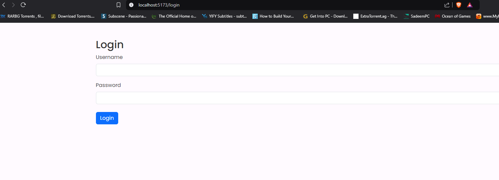
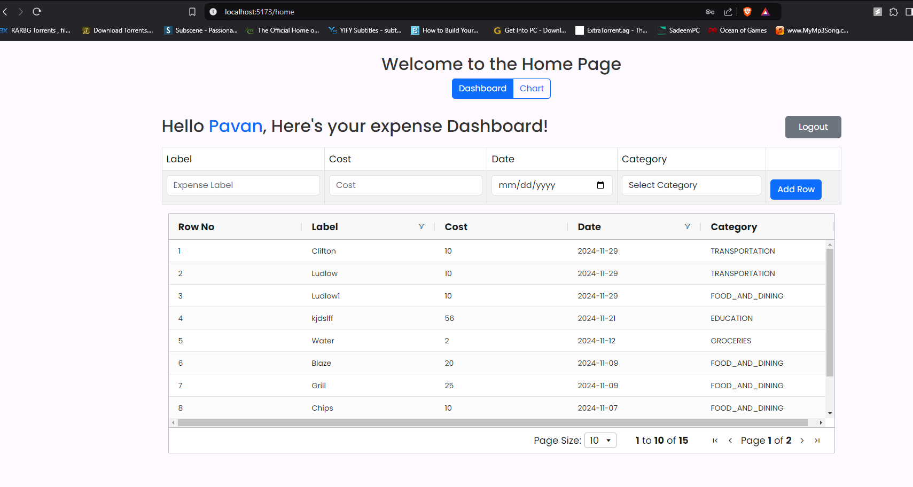
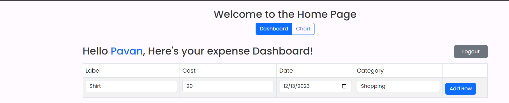
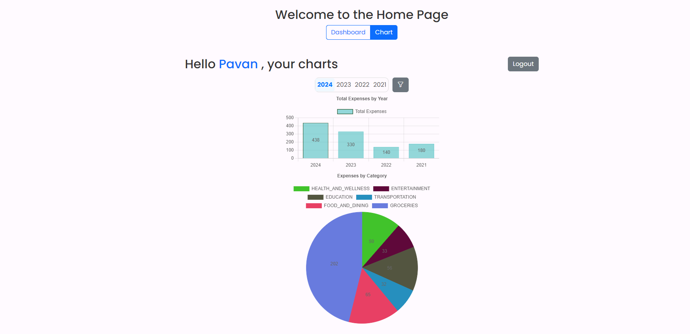
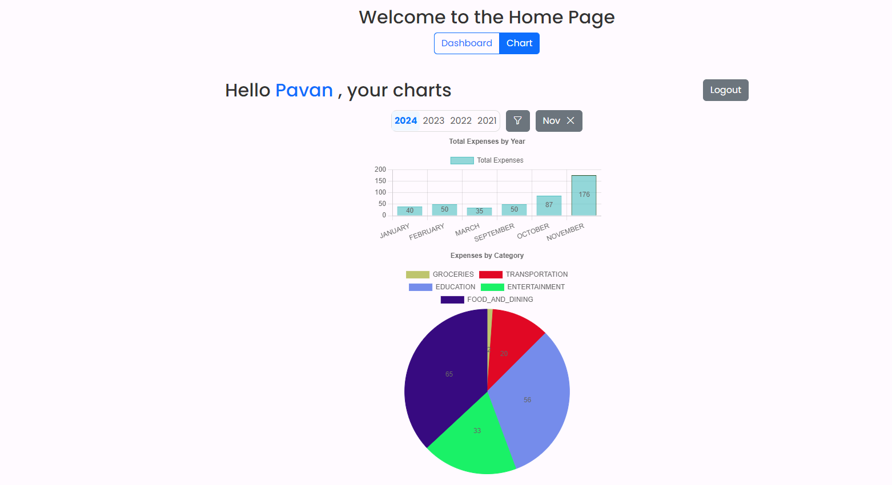

# Personal Expense Tracker Application

## Table of Contents
- [Introduction](#introduction)
- [Technologies Used](#technologies-used)
- [Featuers](#Features)
- [Setup](#setup)
- [Access the Application](#Access-the-Application)
- [API Endpoints](#api-endpoints)
- [Application Screenshots](#UI)

## Introduction

The Expense Tracker Application is a web application developed using React.js, Spring Boot 3, MongoDB for data storage, Mongock for database migration, and Swagger for API documentation. It allows users to manage and track their expenses using interactive charts and dashboards.

## Technologies Used

- React.js
- react-chartjs-2
- Java 17
- Spring Boot 3.0.0
- Spring Security
- MongoDB
- Mongock
- Swagger

## Features

- Authentication
- Add Expenses
- Expenses dashboard
- Pagination of expenses
- Search Expenses
- Filter Expenses

## Setup

1. **Clone the repository:**

    ```bash
    [git clone https://github.com/your-username/personal-expense-tracker.git]
    cd personal-expense-tracker
    ```

2. **Build the application:**
    - Backend
    ```bash
    cd backend
    ./mvn clean install
    ./mvn spring-boot:run
    ```
    - Front end
    ```bash
    cd frontend
    npm install
    npm run dev
    ```
       


3. **Set up MongoDB:**

    Ensure MongoDB is installed and running locally, or update the application's `application.properties` to point to your MongoDB instance.

4. **Configure application properties:**

    Update `src/main/resources/application.properties` with the appropriate MongoDB and other configuration settings.

## Access the Application

1. **Frontend:**

   Navigate to `http://localhost:5173` in your web browser.

2. **Backend:**

   The API documentation is available using Swagger UI. Access it by navigating to `http://localhost:8080/swagger-ui.html` after starting the application.


## API Endpoints

The API supports the following CRUD operations:

- **GET /expense**: Retrieve all expenses.
- **GET /expense/{name}**: Get expense by name
- **GET /expense/yearly-expenses**: Get sum of all expenses for every month of the year
- **GET /expense/total-cost/year**: Retrieve total expenses for the whole year
- **GET /expense/total-cost/year/category**: Retreive total expenses for each category
- **GET /expense/total-cost/month**: Retrieve total expenses for the month
- **GET /expense/total-cost/month/category**: Retrieve total expenses for each category in a month

- **PUT /expense**: Update an expense
- **POST /expense**: Create a new expense
- **POST /api/users/register**: Create a new User


    ## UI
    1. **Login Page**
    
    2. **Expense Table Display**
    
    3. **Add Expense**
    
    4. **Expenses filter by year**
    
    5. **Expenses filter by month**
    
